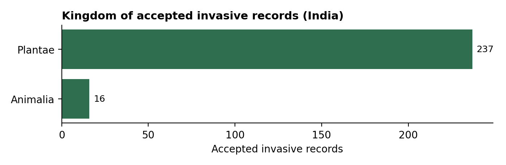
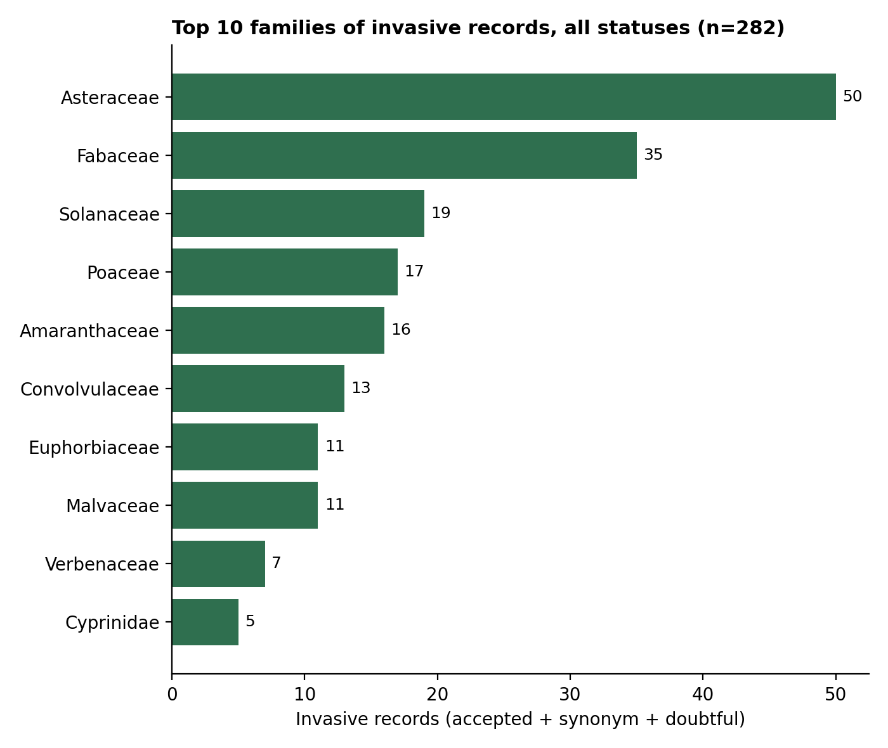

# GRIIS-india-invasive-species-analysis
A biodiversity data analysis of invasive-designated records in GRIIS India, focusing on habitat and taxonomic composition.
## Research Question

How are GRIIS-listed invasive-designated records distributed across habitats and taxonomic groups in India, and how does their taxonomic composition compare with the broader GRIIS India dataset?

## Dataset

This project uses the **Global Register of Introduced and Invasive Species (GRIIS) – India**, Version 1.6.

The dataset contains **2,176 records** and includes taxonomic, habitat, invasive-status and distribution information.

## Data Preparation

The GRIIS India data were organised using three tables:

- `taxon.txt` — taxonomic information
- `speciesprofile.txt` — invasive status and habitat
- `distribution.txt` — distribution and establishment information

The three tables were joined using the common `id` field.

The merged dataset contained **2,176 records**.

For the main analysis, records were filtered to:

- `taxonomicStatus = ACCEPTED`
- `isInvasive = Invasive`

This resulted in **253 accepted invasive-designated records**.

> Records without an invasive designation were not treated as non-invasive.
> ## Analysis

The analysis focused on three main aspects:

1. Habitat distribution of accepted invasive-designated records
2. Kingdom-level taxonomic composition
3. Top 10 families among accepted invasive-designated records

## Results

### Habitat Distribution

| Habitat | Records |
|---|---:|
| Terrestrial | 229 |
| Freshwater | 11 |
| Freshwater \| Brackish | 7 |
| Terrestrial \| Freshwater | 5 |
| Freshwater \| Brackish \| Marine | 1 |

### Kingdom Distribution

| Kingdom | Records |
|---|---:|
| Plantae | 237 |
| Animalia | 16 |

### Top 10 Families

| Family | Records |
|---|---:|
| Asteraceae | 50 |
| Fabaceae | 35 |
| Solanaceae | 19 |
| Poaceae | 17 |
| Amaranthaceae | 16 |
| Convolvulaceae | 13 |
| Malvaceae | 11 |
| Euphorbiaceae | 11 |
| Verbenaceae | 7 |
| Cyprinidae | 5 |
## Visualisations

### Kingdom Distribution

### Top 10 Families
## Ecological Interpretation

The accepted invasive-designated records were predominantly associated with terrestrial habitats, with 229 of the 253 records having a terrestrial habitat designation.

Plantae represented the majority of accepted invasive-designated records, with 237 records, while Animalia accounted for 16 records.

At the family level, Asteraceae had the highest number of records, followed by Fabaceae, Solanaceae, Poaceae and Amaranthaceae.

These results describe the composition of records in the GRIIS India dataset. They should not be interpreted as measures of species abundance, population size, ecological impact or invasion risk.

## Tools Used

- Microsoft Excel
- GRIIS India dataset
- Data cleaning and filtering
- Descriptive tables and charts

## Repository Contents

- `griis_india_clean-1.csv` — cleaned GRIIS India dataset
- `griis_india_accepted_invasive-1.csv` — accepted invasive-designated records
- `raw_taxon.csv` — taxonomic source table
- `speciesprofile.csv` — invasive status and habitat data
- `raw_distribution.csv` — distribution and establishment data
- `chart_kingdom.png` — kingdom distribution chart
- `chart_family.png` — top 10 family chart
- `requirements.txt` — project requirements
- `code_griis_data.pdf` — project analysis document

## Data Source and Citation

Sankaran, K. V., Khuroo, A. A., Raghavan, R., Molur, S., Kumar, B., Wong, L. J., & Pagad, S. (2026). *Global Register of Introduced and Invasive Species – India*. Version 1.6. Invasive Species Specialist Group (ISSG).

DOI: 10.15468/uvnf8m

The GRIIS India dataset is published through GBIF under a CC BY 4.0 licence. Appropriate attribution should be retained when reusing the dataset. 

## Project Scope

This is an independent biodiversity-data analysis project developed for environmental science research and portfolio purposes.

The analysis describes patterns within the GRIIS India dataset. It does not estimate species abundance, population size, ecological impact or invasion risk.
